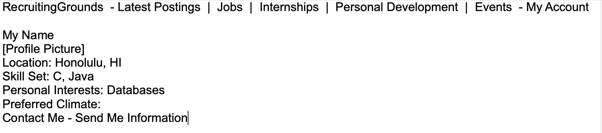
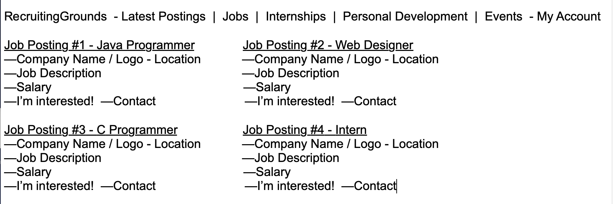

# RecruitingGrounds
### by TWT Connections

For the computing professional, finding the right job-placement is a challenge. For computing firms, finding the right candidates at the right time is just as difficult. RecruitingGrounds connects employers with future employees and potential interns with mentors, allowing for individuals and organizations to seek one another out based on qualifications and needs in a user-friendly and convenient fashion.

Students and professionals looking for a good fit for their particular skill set can easily create a profile and find matching listings by organizations actively recruiting candidates for that skill, and vice versa. Both individuals and organizations provide information necessary for making the right match. 

Individuals can include personal interests or areas they would like to develop, as well as personal goals and strengths.

Organizations can include company background information, which skills they are currently in need of, salary, and the workplace environment candidates will be placed in.

For job postings or information about an upcoming internship, organizations can create a posting with all of the relevant information, and allow interested candidates to apply or seek further information. Similarly, companies actively seeking out a particular skill set or qualifications can send recruiting information to individual candidates directly.

Team Members: Willard Peralta, Tre Gelacio, Ty Gwartney  
Organization Page: https://github.com/twt-connections  
Current Milestone: https://github.com/twt-connections/connections/projects/1
