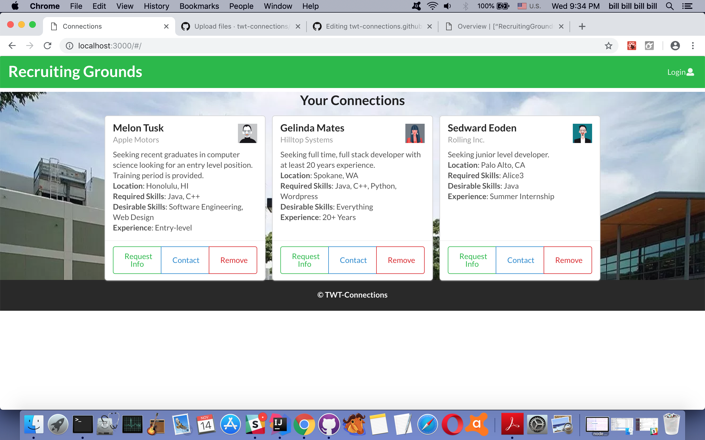

## About
For the computing professional, finding the right job-placement is a challenge. For computing firms, finding the right candidates at the right time is just as difficult. RecruitingGrounds connects employers with future employees and potential interns with mentors, allowing for individuals and organizations to seek one another out based on qualifications and needs in a user-friendly and convenient fashion.

Students and professionals looking for a good fit for their particular skill set can easily create a profile and find matching listings by organizations actively recruiting candidates for that skill, and vice versa. Both individuals and organizations provide information necessary for making the right match. 

Individuals can include personal interests or areas they would like to develop, as well as personal goals and strengths.

Organizations can include company background information, which skills they are currently in need of, salary, and the workplace environment candidates will be placed in.

For job postings or information about an upcoming internship, organizations can create a posting with all of the relevant information, and allow interested candidates to apply or seek further information. Similarly, companies actively seeking out a particular skill set or qualifications can send recruiting information to individual candidates directly.

## Current Status

So far, we have a landing page and four mockup pages ready for viewing.

Landing Page  
 

Student Home Page (mockup)  

Student Profile Page (mockup)  

Company Home Page (mockup)  

Company Profile Page (mockup)  

## User Guide
To get started, click "Log-in" on the landing page to set up an account, and select "Register".

Enter your email address, choose a password, and select your account type depending on whether you are an individual or an organization.

### For Individuals
After creating an account, you will be taken to your account profile page.

Click the "View Listings" tab to view current job and internship listings.

### For Organizations
After creating an account, you will be taken to your account profile page.

Click the "Browse Profiles" tab to view prospective candidates.

## Development Guide
blah blah blah

### TWT Connections
Team Members: Willard Peralta, Tre Gelacio, Ty Gwartney  
Organization Page: <a href="https://github.com/twt-connections">https://github.com/twt-connections</a>  
Current Deployment: <a href="http://recruitinggrounds.meteorapp.com">http://recruitinggrounds.meteorapp.com</a>  
Current Milestone (M2): <a href="https://github.com/twt-connections/recruiting-grounds/projects/2">https://github.com/twt-connections/recruiting-grounds/projects/2<a/>

### Completed Milestones
First Milestone (M1): <a href="https://github.com/twt-connections/connections/projects/1">https://github.com/twt-connections/connections/projects/1</a>
